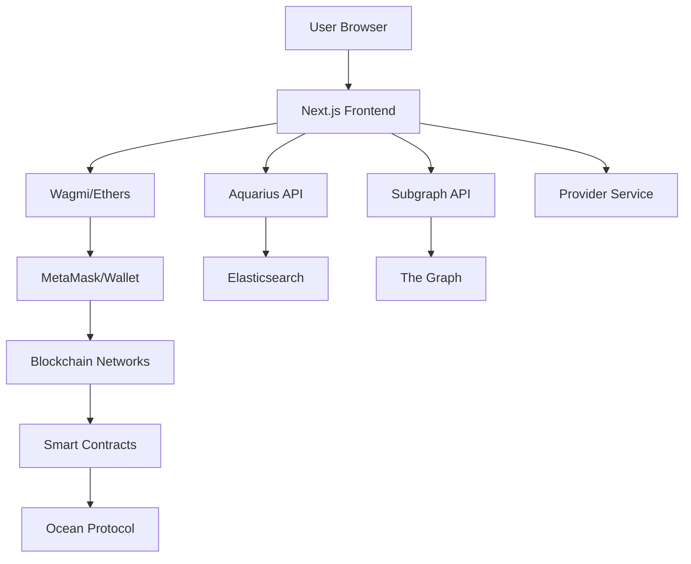

# Architecture Overview

The AgrospAI Data Space Portal is a sophisticated decentralized application (dApp) that combines modern web technologies with blockchain infrastructure to create a secure, scalable data marketplace.

<Info>
This document provides a technical overview of the portal's architecture, covering the frontend framework, blockchain integration, data sources, and key components.
</Info>

## System Architecture

The portal follows a multi-layered architecture that separates concerns while maintaining seamless integration:



## Technology Stack

The portal is built on a robust technology stack optimized for Web3 applications.

### Frontend Framework

<Tabs>
  <Tab title="Next.js">
    The portal uses **Next.js 13** with the following configuration:
    
    ```javascript title="Next.js Configuration" next.config.js
    module.exports = (phase, { defaultConfig }) => {
      const nextConfig = {
        output: 'standalone',
        webpack: (config, options) => {
          config.module.rules.push(
            {
              test: /\.svg$/,
              issuer: /\.(tsx|ts)$/,
              use: [{ loader: '@svgr/webpack', options: { icon: true } }]
            },
            {
              test: /\.gif$/,
              type: 'asset/resource'
            }
          )
          
          // Browser polyfills for crypto and networking
          const fallback = config.resolve.fallback || {}
          Object.assign(fallback, {
            http: require.resolve('stream-http'),
            https: require.resolve('https-browserify'),
            fs: false,
            crypto: false,
            os: false,
            stream: false
          })
          config.resolve.fallback = fallback
          
          return config
        },
        experimental: {
          instrumentationHook: true
        }
      }
      return nextConfig
    }
    ```
    
    **Key Features:**
    - Standalone output for containerization
    - Webpack customization for Web3 dependencies
    - SVG component support
    - Browser polyfills for crypto operations
  </Tab>
  
  <Tab title="TypeScript">
    The entire codebase is written in **TypeScript** for type safety:
    
    ```json title="Package Info" package.json
    {
      "name": "@deltaDAO/mvg-portal",
      "description": "Pontus-X - Gaia-X Web3 Ecosystem",
      "version": "1.0.0",
      "license": "Apache-2.0",
      "engines": {
        "node": "22"
      }
    }
    ```
    
    TypeScript provides:
    - Compile-time error detection
    - Enhanced IDE support
    - Better code documentation
    - Improved refactoring capabilities
  </Tab>
  
  <Tab title="React 18">
    Modern React features are utilized throughout:
    
    - Hooks for state management
    - Context API for global state
    - Suspense for async operations
    - Error boundaries for fault tolerance
  </Tab>
</Tabs>

### Blockchain Integration

The portal integrates with blockchain through multiple layers:

<Steps>
  <Step title="Wagmi">
    **Wagmi** provides React Hooks for Ethereum:
    
    ```typescript title="Wagmi Client Setup" src/@utils/wallet/index.ts
    import { configureChains, createClient, erc20ABI } from 'wagmi'
    import { ethers, Contract, Signer } from 'ethers'
    import { getOceanConfig } from '../ocean'
    import { getSupportedChains } from './chains'
    import { MetaMaskConnector } from 'wagmi/connectors/metaMask'
    import { jsonRpcProvider } from 'wagmi/providers/jsonRpc'

    function getProvider() {
      return jsonRpcProvider({
        rpc: (chain) => {
          const config = getOceanConfig(chain.id)
          return { http: config.nodeUri }
        }
      })
    }

    const supportedChains = getSupportedChains(chainIdsSupported)
    const { chains, provider, webSocketProvider } = configureChains(
      supportedChains,
      [getProvider()]
    )

    export const wagmiClient = createClient({
      autoConnect: true,
      connectors: [
        new MetaMaskConnector({ chains }),
        new EthersWalletConnector({ chains })
      ],
      provider,
      webSocketProvider
    })
    ```
    
    This configuration:
    - Supports multiple chains dynamically
    - Enables auto-connection on page load
    - Provides both HTTP and WebSocket providers
    - Integrates custom wallet connectors
  </Step>
  
  <Step title="Ethers.js">
    **Ethers.js** handles low-level blockchain operations:
    
    ```typescript title="Token Balance Check" src/@utils/wallet/index.ts
    export async function getTokenBalance(
      accountId: string,
      decimals: number,
      tokenAddress: string,
      web3Provider: ethers.providers.Provider
    ): Promise<string> {
      if (!web3Provider || !accountId || !tokenAddress) return

      try {
        const token = new Contract(tokenAddress, erc20ABI, web3Provider)
        const balance = await token.balanceOf(accountId)
        return balance ? getAdjustDecimalsValue(balance, decimals) : null
      } catch (e) {
        LoggerInstance.error(`ERROR: Failed to get the balance: ${e.message}`)
      }
    }
    ```
  </Step>
  
  <Step title="ConnectKit">
    **ConnectKit** provides the wallet connection UI:
    
    ```typescript title="App Setup" src/pages/_app.tsx
    import { connectKitTheme, wagmiClient } from '@utils/wallet'
    import { ConnectKitProvider } from 'connectkit'
    import { WagmiConfig } from 'wagmi'

    function MyApp({ Component, pageProps }: AppProps): ReactElement {
      return (
        <WagmiConfig client={wagmiClient}>
          <ConnectKitProvider
            options={{ initialChainId: 0 }}
            customTheme={connectKitTheme}
          >
            <MarketMetadataProvider>
              {/* App components */}
            </MarketMetadataProvider>
          </ConnectKitProvider>
        </WagmiConfig>
      )
    }
    ```
    
    Custom theming ensures brand consistency:
    
    ```typescript title="ConnectKit Theme" src/@utils/wallet/index.ts
    export const connectKitTheme = {
      '--ck-font-family': 'var(--font-family-base)',
      '--ck-border-radius': 'var(--border-radius)',
      '--ck-overlay-background': 'var(--background-body-transparent)',
      '--ck-modal-box-shadow': '0 0 20px 20px var(--box-shadow-color)',
      '--ck-body-background': 'var(--background-body)',
      '--ck-body-color': 'var(--font-color-text)',
      '--ck-primary-button-border-radius': 'var(--border-radius)',
      '--ck-primary-button-color': 'var(--font-color-heading)',
      '--ck-primary-button-background': 'var(--background-content)',
      '--ck-secondary-button-border-radius': 'var(--border-radius)'
    }
    ```
  </Step>
</Steps>

## Ocean Protocol Integration

Ocean Protocol provides the core decentralized data exchange functionality.

### Configuration

Ocean configuration is managed centrally:

```typescript title="Ocean Config" src/@utils/ocean/index.ts
import { ConfigHelper, Config } from '@oceanprotocol/lib'
import { chains, getCustomChainIds } from '../../../chains.config'

export function getOceanConfig(network: string | number): Config {
  const filterBy = typeof network === 'string' ? 'network' : 'chainId'
  const customConfig = chains.find((c) => c[filterBy] === network)

  if (getCustomChainIds().includes(network as number))
    return customConfig as Config

  let config = new ConfigHelper().getConfig(
    network,
    process.env.NEXT_PUBLIC_INFURA_PROJECT_ID
  ) as Config
  
  return customConfig
    ? ({ ...config, ...customConfig } as Config)
    : (config as Config)
}
```

<Note>
This allows seamless integration with both standard Ocean networks and custom Gaia-X networks like Pontus-X.
</Note>

### Smart Contracts

Key smart contracts include:

<AccordionGroup>
  <Accordion title="NFT Factory">
    Creates ERC-721 NFTs representing asset ownership:
    
    ```javascript title="NFT Factory Address" app.config.js
    nftFactoryAddress: process.env.NEXT_PUBLIC_NFT_FACTORY_ADDRESS
    ```
  </Accordion>
  
  <Accordion title="Datatoken Factory">
    Mints ERC-20 datatokens for access control:
    
    ```javascript title="Datatoken Template" app.config.js
    defaultDatatokenTemplateIndex: 2,
    ```
  </Accordion>
  
  <Accordion title="Fixed Rate Exchange">
    Enables fixed-price token swaps:
    
    ```javascript title="Fixed Rate Exchange" app.config.js
    publisherMarketFixedSwapFee:
      process.env.NEXT_PUBLIC_PUBLISHER_MARKET_FIXED_SWAP_FEE || '0',
    ```
  </Accordion>
  
  <Accordion title="Dispenser">
    Distributes free datatokens:
    
    ```javascript title="Dispenser Config" app.config.js
    allowFreePricing: process.env.NEXT_PUBLIC_ALLOW_FREE_PRICING || 'true',
    ```
  </Accordion>
</AccordionGroup>

## Data Sources

The portal aggregates data from multiple sources:

### Aquarius - Metadata Cache

**Aquarius** is Ocean Protocol's metadata cache powered by Elasticsearch:

```javascript title="Aquarius Configuration" app.config.js
metadataCacheUri:
  process.env.NEXT_PUBLIC_METADATACACHE_URI || 'https://aquarius.pontus-x.eu',
```

**Querying Aquarius:**

```typescript title="Aquarius Query Example"
import { QueryResult } from '@oceanprotocol/lib/dist/node/metadatacache/MetadataCache'
import { queryMetadata } from '@utils/aquarius'

const queryLatest = {
  query: {
    query_string: { query: `-isInPurgatory:true` }
  },
  sort: { created: 'desc' }
}

const result = await queryMetadata(query, source.token)
```

<Tip>
Aquarius supports full Elasticsearch query syntax, enabling complex searches, filters, and aggregations.
</Tip>

### The Graph - Subgraph

**The Graph** indexes blockchain data and provides a GraphQL API:

```typescript title="GraphQL Query Example"
import { gql, useQuery } from 'urql'

const query = gql`
  query TopSalesQuery {
    users(first: 20, orderBy: totalSales, orderDirection: desc) {
      id
      totalSales
    }
  }
`

function Component() {
  const { data } = useQuery(query, {}, { pollInterval: 5000 })
  return <div>{data}</div>
}
```

**Subgraph Endpoint:**

```bash
https://subgraph.test.pontus-x.eu/subgraphs/name/oceanprotocol/ocean-subgraph
```

### Provider Service

The **Provider** service handles off-chain operations:

- File encryption/decryption
- Access validation
- Compute job orchestration
- Asset downloads

```javascript title="Provider Configuration" app.config.js
customProviderUrl: process.env.NEXT_PUBLIC_PROVIDER_URL,
```

**Example Provider Usage:**

```typescript title="DDO Encryption" src/components/Publish/index.tsx
import { ProviderInstance } from '@oceanprotocol/lib'

const ddoEncrypted = await ProviderInstance.encrypt(
  ddo,
  ddo.chainId,
  customProviderUrl || values.services[0].providerUrl.url,
  newAbortController()
)
```

## State Management

The portal uses React Context API for global state:

<CardGroup cols={2}>
  <Card title="MarketMetadataProvider" icon="store">
    Manages market-wide configuration and metadata
  </Card>
  
  <Card title="UserPreferencesProvider" icon="user">
    Handles user preferences like theme, language, and network selection
  </Card>
  
  <Card title="UrqlProvider" icon="database">
    Provides GraphQL client for subgraph queries
  </Card>
  
  <Card title="AutomationProvider" icon="robot">
    Manages automation wallet features
  </Card>
</CardGroup>

**Provider Hierarchy:**

```typescript title="Provider Structure" src/pages/_app.tsx
<MarketMetadataProvider>
  <UrqlProvider>
    <UserPreferencesProvider>
      <AutomationProvider>
        <ConsentProvider>
          <SearchBarStatusProvider>
            <FilterProvider>
              <QueryClientProvider client={queryClient}>
                <App>
                  <Component {...pageProps} />
                </App>
              </QueryClientProvider>
            </FilterProvider>
          </SearchBarStatusProvider>
        </ConsentProvider>
      </AutomationProvider>
    </UserPreferencesProvider>
  </UrqlProvider>
</MarketMetadataProvider>
```

## Publishing Workflow

The publishing process involves multiple steps with blockchain transactions:

<Steps>
  <Step title="Create Tokens">
    Create NFT and datatokens with pricing:
    
    ```typescript title="Token Creation" src/components/Publish/index.tsx
    async function create(values: FormPublishData) {
      const config = getOceanConfig(chain?.id)
      LoggerInstance.log('[publish] using config: ', config)

      const { erc721Address, datatokenAddress, txHash } =
        await createTokensAndPricing(values, accountIdToUse, config, nftFactory)

      const isSuccess = Boolean(erc721Address && datatokenAddress && txHash)
      if (!isSuccess) throw new Error('No Token created. Please try again.')

      return { erc721Address, datatokenAddress }
    }
    ```
  </Step>
  
  <Step title="Encrypt DDO">
    Build and encrypt the DDO (Decentralized Data Object):
    
    ```typescript title="DDO Encryption" src/components/Publish/index.tsx
    async function encrypt(
      values: FormPublishData,
      erc721Address: string,
      datatokenAddress: string
    ) {
      const ddo = await transformPublishFormToDdo(
        values,
        datatokenAddress,
        erc721Address
      )

      const ddoEncrypted = await ProviderInstance.encrypt(
        ddo,
        ddo.chainId,
        customProviderUrl || values.services[0].providerUrl.url,
        newAbortController()
      )

      return { ddo, ddoEncrypted }
    }
    ```
  </Step>
  
  <Step title="Publish Metadata">
    Write metadata to the NFT:
    
    ```typescript title="Metadata Publishing" src/components/Publish/index.tsx
    async function publish(
      values: FormPublishData,
      ddo: DDO,
      ddoEncrypted: string
    ) {
      const res = await setNFTMetadataAndTokenURI(
        ddo,
        accountIdToUse,
        signerToUse,
        values.metadata.nft,
        newAbortController()
      )
      const tx = await res.wait()
      
      return { did: ddo.id }
    }
    ```
  </Step>
</Steps>

## Asset Access Flow

Accessing a dataset involves validation and payment:

```typescript title="Access Control" src/components/Asset/AssetActions/Download/index.tsx
async function handleOrderOrDownload(dataParams?: UserCustomParameters) {
  setIsLoading(true)
  try {
    if (isOwned) {
      // User already owns access - download directly
      setIsDownloading(true)
      await Promise.all([
        downloadFile(signer, asset, accountId, validOrderTx, dataParams),
        new Promise((resolve) => setTimeout(resolve, 3000))
      ])
      setIsDownloading(false)
    } else {
      // User needs to purchase - create order
      const orderTx = await order(
        signer,
        asset,
        orderPriceAndFees,
        accountId,
        hasDatatoken
      )
      const tx = await orderTx.wait()
      if (!tx) throw new Error()
      
      setIsOwned(true)
      setValidOrderTx(tx.transactionHash)
    }
  } catch (error) {
    LoggerInstance.error(error)
    toast.error('An error occurred, please retry.')
  }
  setIsLoading(false)
}
```

<Warning>
All access operations require a valid signature from the connected wallet. Never share your private keys or seed phrase.
</Warning>

## Compliance and Security

The portal implements several compliance and security features:

### GDPR Compliance

```javascript title="Privacy Configuration" app.config.js
privacyPreferenceCenter:
  process.env.NEXT_PUBLIC_PRIVACY_PREFERENCE_CENTER || 'false',

defaultPrivacyPolicySlug: '/privacy/en',
```

### Gaia-X Integration

```javascript title="Gaia-X Registries" app.config.js
allowedGaiaXRegistryDomains: [
  'https://registry.gaia-x.eu/v2206',
  'https://registry.lab.gaia-x.eu/v2206'
],
```

### Compliance API

```javascript title="Compliance Endpoint" app.config.js
complianceUri:
  process.env.NEXT_PUBLIC_COMPLIANCE_URI ||
  'https://www.delta-dao.com/compliance',

complianceApiVersion:
  process.env.NEXT_PUBLIC_COMPLIANCE_API_VERSION || '2210',
```

## Network Monitoring

The portal includes network health monitoring:

```javascript title="Network Alert Config" app.config.js
networkAlertConfig: {
  // Refresh interval - 30 seconds
  refreshInterval: 30000,
  // Block count error margin
  errorMargin: 10,
  // Status endpoints by chainId
  statusEndpoints: {
    32456: 'https://status.dev.pontus-x.eu/'
  }
}
```

## Performance Optimizations

<Tabs>
  <Tab title="Caching">
    - React Query for API response caching
    - Next.js page caching
    - Browser localStorage for preferences
  </Tab>
  
  <Tab title="Code Splitting">
    - Dynamic imports with `@loadable/component`
    - Route-based code splitting via Next.js
    - Lazy loading of heavy components
  </Tab>
  
  <Tab title="Asset Optimization">
    - SVG components via SVGR
    - Image optimization with Next.js Image
    - CSS modules for scoped styling
  </Tab>
</Tabs>

## Deployment Architecture

The portal supports multiple deployment strategies:

```javascript title="Build Configuration" package.json
{
  "scripts": {
    "build": "npm run postinstall && npm run pregenerate && next build",
    "build:static": "npm run build && next export",
    "serve": "serve -s public/"
  }
}
```

<CardGroup cols={2}>
  <Card title="Standalone Mode" icon="box">
    Docker-friendly standalone build for containerized deployments
  </Card>
  
  <Card title="Static Export" icon="file-export">
    Static HTML export for CDN hosting (Netlify, Vercel, S3)
  </Card>
</CardGroup>

## Development Tools

### Testing

```javascript title="Test Configuration" package.json
{
  "scripts": {
    "test": "npm run pregenerate && npm run lint && npm run type-check && npm run jest",
    "jest": "jest -c .jest/jest.config.js",
    "jest:watch": "jest -c .jest/jest.config.js --watch"
  }
}
```

**Testing Stack:**
- Jest for unit testing
- Testing Library for component testing
- Storybook for component development

### Code Quality

```javascript title="Quality Scripts" package.json
{
  "scripts": {
    "lint": "eslint --ignore-path .gitignore --ext .js --ext .ts --ext .tsx .",
    "lint:fix": "eslint --ignore-path .gitignore --ext .ts,.tsx . --fix",
    "format": "prettier --ignore-path .gitignore './**/*.{css,yml,js,ts,tsx,json}' --write",
    "type-check": "tsc --noEmit"
  }
}
```

## Extension Points

The architecture supports various extensions:

<AccordionGroup>
  <Accordion title="Custom Networks">
    Add new blockchain networks via `chains.config.js`:
    
    ```javascript
    module.exports = {
      chains: [
        {
          chainId: 32456,
          network: 'pontusx',
          metadataCacheUri: 'https://aquarius.pontus-x.eu',
          nodeUri: 'https://rpc.pontus-x.eu'
        }
      ]
    }
    ```
  </Accordion>
  
  <Accordion title="Custom Components">
    Extend UI with new components in `src/components/@shared/`
  </Accordion>
  
  <Accordion title="API Integration">
    Add new data sources by creating providers in `src/@context/`
  </Accordion>
  
  <Accordion title="Analytics">
    Integrate analytics via the analytics configuration:
    
    ```javascript title="Analytics Config" app.config.js
    plausibleDataDomain: false,
    ```
  </Accordion>
</AccordionGroup>

## Summary

The AgrospAI Data Space Portal architecture provides:

✅ **Scalability** - Modular design supports growth and new features  
✅ **Security** - Multiple layers of validation and encryption  
✅ **Compliance** - Built-in GDPR and Gaia-X support  
✅ **Performance** - Optimized with caching and code splitting  
✅ **Extensibility** - Clean interfaces for customization  
✅ **Maintainability** - TypeScript, testing, and documentation

<Tip>
For implementation details of specific features, refer to the source code in the repository. All major components include inline documentation.
</Tip>